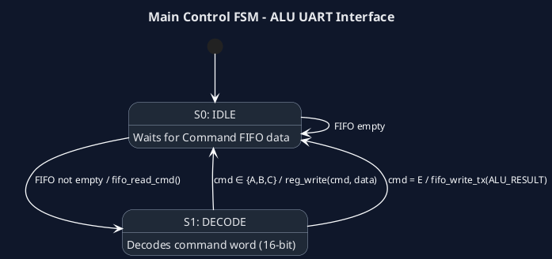

```plantuml
@startuml
title Main Control FSM – ALU UART Interface
hide empty description
skinparam backgroundColor #0f172a

skinparam state {
  BackgroundColor #1f2937
  BorderColor #94a3b8
  FontColor #e5e7eb
  FontName Consolas
  FontSize 14
  RoundCorner 10
}
skinparam title {
  FontColor #e5e7eb
  FontName Consolas
  FontSize 16
}
skinparam arrow {
  Color #f8fafc
  FontColor #f8fafc
  FontSize 12
  Thickness 1.3
}

[*] --> IDLE

state "S0: IDLE" as IDLE
state "S1: DECODE" as DECODE

' --- IDLE behavior ---
IDLE : Waits for Command FIFO data
IDLE --> IDLE : FIFO empty
IDLE --> DECODE : FIFO not empty / fifo_read_cmd()

' --- DECODE behavior ---
DECODE : Decodes command word (16-bit)

DECODE --> IDLE : cmd ∈ {A,B,C} / reg_write(cmd, data)
DECODE --> IDLE : cmd = E / fifo_write_tx(ALU_RESULT)
@enduml
```