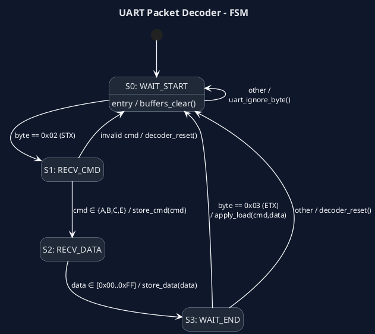

```plantuml
@startuml
title UART Packet Decoder – FSM
hide empty description
skinparam backgroundColor #0f172a

skinparam state {
  BackgroundColor #1f2937
  BorderColor #94a3b8
  FontColor #e5e7eb
  FontName Consolas
  FontSize 14
  RoundCorner 10
}
skinparam title {
  FontColor #e5e7eb
  FontName Consolas
  FontSize 16
}
skinparam arrow {
  Color #f8fafc
  FontColor #f8fafc
  FontSize 12
  Thickness 1.3
}

state "S0: WAIT_START" as S0
state "S1: RECV_CMD"   as S1
state "S2: RECV_DATA"  as S2
state "S3: WAIT_END"   as S3

[*] --> S0
S0 : entry / buffers_clear()

S0 --> S1 : byte == 0x02 (STX)
S0 -up-> S0 : other /\nuart_ignore_byte()

S1 --> S2 : cmd ∈ {A,B,C,E} / store_cmd(cmd)
S1 --> S0 <<Error>> : invalid cmd / decoder_reset()

S2 --> S3 : data ∈ [0x00..0xFF] / store_data(data)

S3 --> S0 : byte == 0x03 (ETX)\n/ apply_load(cmd,data)
S3 --> S0 <<Error>> : other / decoder_reset()

@enduml
```
