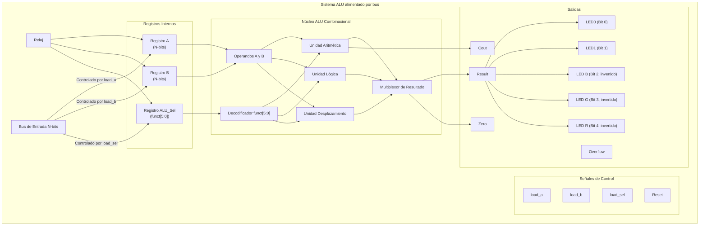
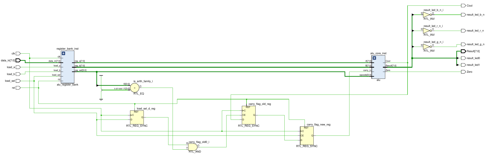
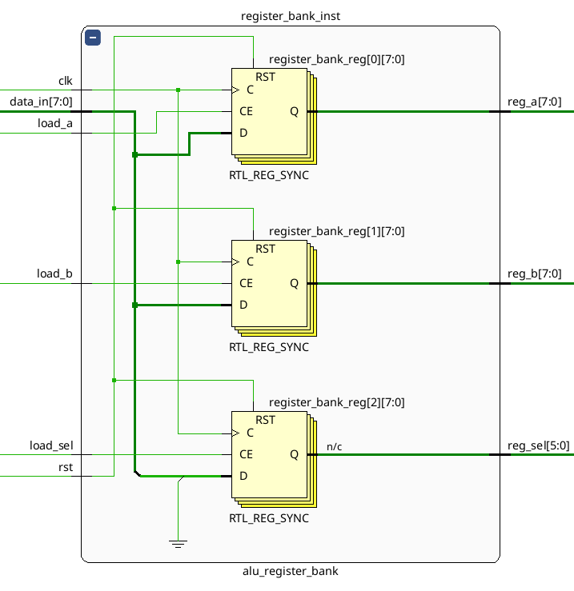
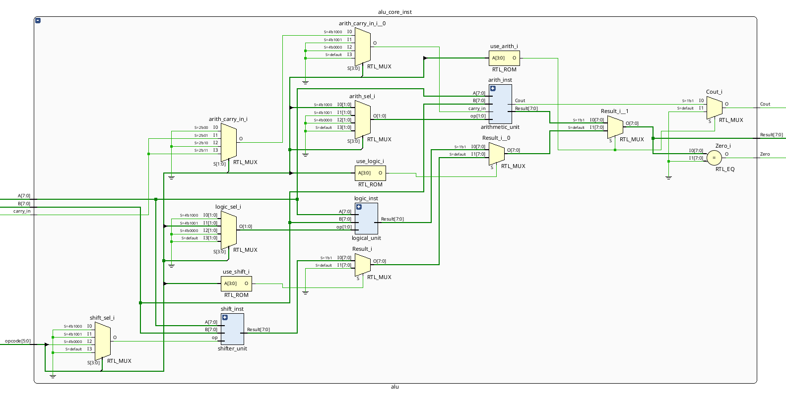
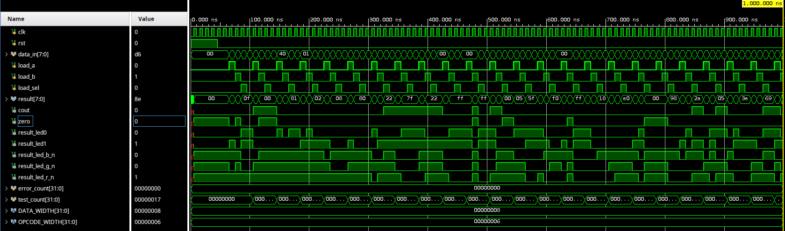
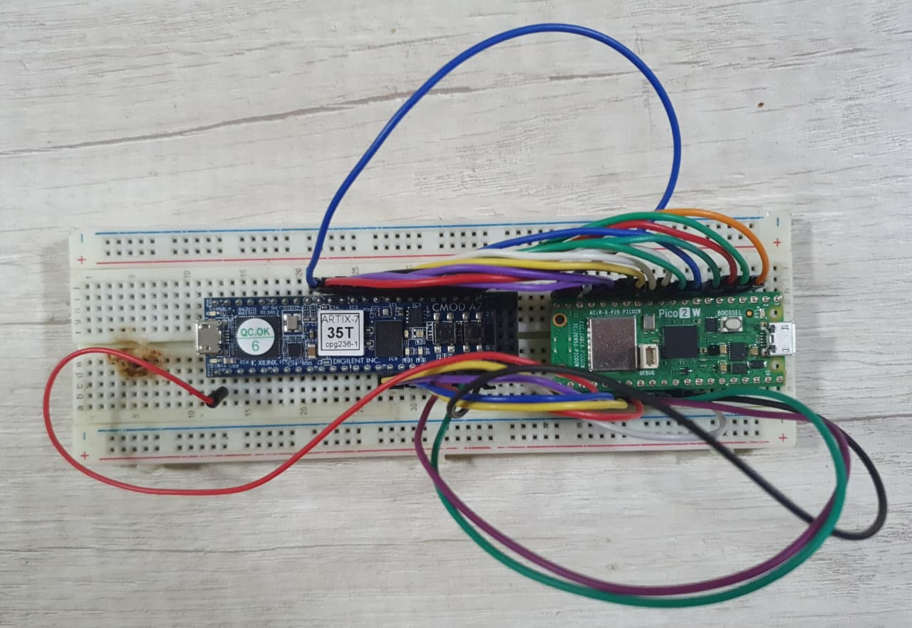

  

***TRABAJO PRACTICO 1***

**Titulo:** Sistema ALU con bus único y control por microcontrolador

**Asignatura:** Arquitectura de Computadoras

**Integrantes:**
   - Ignacio Ledesma
   - Ivan Zuñiga

---------------
## Enunciado

Desarrollar una Unidad Lógica Aritmética (ALU) parametrizable en lenguaje Verilog, capaz de operar sobre un bus de datos configurable. La ALU debe ser implementada en una FPGA, validada mediante un testbench en Verilog y controlada por una Raspberry Pi Pico.

### Requerimientos

1. **ALU parametrizable:**
    - La ALU deberá ser diseñada de manera que permita cambiar el ancho del bus de datos de forma paramétrica (`DATA_WIDTH`).
    - Deberá soportar operaciones aritméticas, lógicas y de desplazamiento, decodificadas a partir de un `opcode`.

2. **Test Bench:**
    - Implementar un banco de pruebas en Verilog para validar el correcto funcionamiento de la ALU.
    - El testbench deberá incluir la generación de vectores de prueba para verificar las distintas operaciones.
    - Incorporar un sistema de chequeo automático para comparar los resultados esperados con los obtenidos.

3. **Simulación y análisis:**
    - Simular el diseño utilizando Vivado y visualizar las formas de onda con su herramienta para gráficar.
    - Realizar un análisis funcional para verificar el comportamiento de la ALU.

4. **Control Externo:**
    - Implementar un sistema de control mediante una Raspberry Pi Pico que se comunique con la FPGA para enviar operandos, opcodes y leer resultados.

<em>Figura 1: Diagrama Conceptual en Mermaid</em>

## Arquitectura y Descripción del Código

A continuación se describe la arquitectura del sistema. Para cada componente, se explica su función dentro de la arquitectura y los detalles relevantes de su implementación en Verilog.

### 1. Paquete de Definiciones: `alu_pkg.v`

*   **Función:** Centraliza las definiciones de tipos de datos y constantes para mejorar la legibilidad y mantenibilidad del código, evitando el uso de "números mágicos".
*   **Detalles de Implementación:** Define tipos enumerados (`enum`) de SystemVerilog para las familias de operaciones (`OPCODE_FAMILY_ARITH`, `OPCODE_FAMILY_LOGIC`, `OPCODE_FAMILY_SHIFT`) y para los selectores de operaciones específicas que se usan dentro de cada unidad (`arith_sel_t`, `logic_sel_t`, `shift_sel_t`).

### 2. Módulo Principal: `alu_top.v`

*   **Función:** Es el módulo de más alto nivel que integra todo el sistema. Conecta el banco de registros con el núcleo de la ALU y gestiona el flujo de datos y control con el exterior.
*   **Detalles de Implementación:** Instancia `alu_register_bank` y `alu`. Contiene la lógica secuencial para registrar el flag de `carry` entre operaciones consecutivas y conecta las salidas finales a los puertos del módulo, incluyendo los LEDs de la placa en espejo.

  

<em>Figura 2: Esquema RTL del módulo `alu_top`</em>

### 3. Banco de Registros: `alu_register_bank.v`

*   **Función:** Actúa como una interfaz secuencial que captura los operandos (`A`, `B`) y el `opcode` desde un único bus de datos (`data_in`), permitiendo el control por parte de un dispositivo externo.
*   **Detalles de Implementación:** Utiliza un bloque `always @(posedge clk)` para la lógica síncrona. Las señales `load_a`, `load_b` y `load_sel` actúan como enables de escritura para los registros internos, generando así salidas estables (`reg_a`, `reg_b`, `reg_sel`) para el núcleo de la ALU.

  

<em>Figura 3: Esquema RTL del módulo `alu_register_bank`</em>

### 4. Núcleo Computacional: `alu.v`

*   **Función:** Es un módulo puramente combinacional que decodifica el `opcode` y selecciona la sub-unidad apropiada para realizar el cálculo.
*   **Detalles de Implementación:** Utiliza un bloque `always @(*)` con una sentencia `case` para decodificar la `opcode_family_t`. Instancia las tres sub-unidades y multiplexa el resultado de la unidad activa hacia la salida `Result`.

  

<em>Figura 4: Esquema RTL del módulo `alu`</em>

### 5. Sub-unidades de Cómputo

*   **Función:** Son los módulos combinacionales que ejecutan las operaciones matemáticas y lógicas.
*   **Detalles de Implementación:**
    *   **`arithmetic_unit.v`**: Implementa la suma y la resta, ambas con y sin carry. Es el único módulo que calcula y emite un `Cout`.
    *   **`logical_unit.v`**: Implementa las operaciones `AND`, `OR`, `XOR`, y `NOR` bit a bit.
    *   **`shifter_unit.v`**: Implementa los desplazamientos a la derecha `SRL` (lógico, `>>`) y `SRA` (aritmético, `>>>`), usando el operando B para determinar la cantidad de bits a desplazar.

---

## Verificación del Diseño

Para garantizar el correcto funcionamiento de la ALU, se implementaron dos metodologías de prueba complementarias: una simulación lógica y una prueba física de integración en hardware.

### 1. Simulación Lógica (SystemVerilog y Vivado)

Esta prueba se centra en verificar la correctitud funcional del diseño RTL en un entorno de simulación de Vivado. El sistema de prueba se compone de tres archivos principales:

*   **`gen_test_vectors.py`**: Un script de Python que actúa como "golden model". Genera una gran cantidad de vectores de prueba, incluyendo casos especificos para cada una de las operaciones y casos aleatorios. Para cada vector, calcula el resultado esperado y los flags (`Cout`, `Zero`), emulando la lógica de la ALU en Python.
*   **`alu_test_vectors.svh`**: Un archivo header de SystemVerilog que es generado automáticamente por el script anterior. Contiene los vectores de prueba (entradas y resultados esperados) en forma de arrays de `structs`, listos para ser consumidos por el testbench.
*   **`tb_alu.sv`**: El testbench principal, escrito en SystemVerilog. Este módulo instancia el `alu_top` (DUT), importa los vectores de prueba desde `alu_test_vectors.svh` y los aplica secuencialmente. En cada paso, compara la salida del DUT con el resultado esperado del vector de prueba y reporta cualquier discrepancia.

Este enfoque permite una verificación robusta y automatizada del RTL de forma aislada, asegurando que la lógica del Verilog es correcta antes de la implementación en hardware. Se utiliza un script en Python como golden model para generar los resultados esperados, desacoplando la lógica de verificación del testbench. 

  

<em>Figura 5: Visualización de la Simulación en Vivado</em>

### 2. Prueba Física de Integración (Python y Raspberry Pi Pico)

Mientras que la simulación verifica el RTL, esta prueba valida el sistema completo en el hardware real, incluyendo la interacción entre la Raspberry Pi Pico y la FPGA.

El test se maneja mediante el script **`pico_uart_to_fpga/scripts/uart_selftest.py`**. Este script se ejecuta en un PC y se comunica vía UART con la Pico. El flujo es el siguiente:

1.  El script de Python envía comandos de alto nivel a la Pico (ej. "cargar operando A con 0x10", "fijar opcode a ADD", "leer resultado").
2.  El firmware de la Pico (`main.cpp`) interpreta estos comandos y manipula los pines GPIO conectados a la FPGA, generando las señales de control (`load_a`, `load_b`, `load_sel`) y poniendo los datos en el bus `data_in`.
3.  La ALU en la FPGA procesa la operación.
4.  El firmware de la Pico lee el resultado directamente de los pines GPIO de la FPGA y lo envía de vuelta al PC a través de UART.
5.  El script de Python recibe la respuesta y la compara con el resultado esperado, reportando éxito o fallo.

Esta es una prueba de integración "end-to-end" que verifica no solo la ALU, sino también el firmware del microcontrolador y la correcta comunicación física entre ambos dispositivos.

## Archivo de Restricciones: `constraints.xdc`

Para la creación de este archivo se tomó como base `Cmod-A7-Master.xdc` proporcionado por Digilent, el cual contiene las asignaciones para todos los periféricos de la placa. A partir de este, se descomentaron y renombraron los puertos necesarios para este proyecto específico.

Este archivo es el puente fundamental entre el diseño lógico abstracto (el código Verilog) y el mundo físico de la placa FPGA (la Cmod A7-35T). Su función no es solo asignar pines, sino también guiar a las herramientas de Vivado para que implementen un diseño que sea eléctricamente compatible y que pueda funcionar a la velocidad requerida.

Se divide en tres tipos principales de restricciones:

#### 1. Restricciones Físicas (Pines y Voltajes)

*   **Asignación de Pines (`PACKAGE_PIN`):** Conecta cada puerto del módulo `alu_top` a un pin físico específico en el encapsulado de la FPGA. Por ejemplo, la línea `set_property -dict { PACKAGE_PIN L17 ... } [get_ports {clk}]` conecta la entrada de reloj del diseño al pin `L17`, donde se encuentra el oscilador de 12 MHz de la placa.
*   **Estándar de E/S (`IOSTANDARD`):** Define el estándar eléctrico para cada pin. En este caso, se usa `LVCMOS33` para todos los puertos, lo que configura los bancos de la FPGA para operar con lógica de 3.3V. Esto es crucial para garantizar la compatibilidad con los periféricos de la placa y, sobre todo, con los pines GPIO de la Raspberry Pi Pico.

#### 2. Restricciones de Temporización (Timing Constraints)

Estas son las restricciones más importantes para asegurar que el diseño funcione correctamente en el tiempo.

*   **Definición del Reloj (`create_clock`):** La línea `create_clock -period 83.333 ... [get_ports {clk}]` define la señal `clk` como una fuente de reloj con un período de 83.333 ns (12 MHz). Esta es la restricción maestra que dicta el ritmo de todo el diseño. Las herramientas de Vivado la utilizan como referencia para realizar el Análisis de Temporización Estático (STA) y verificar que todas las rutas lógicas puedan completarse dentro de un ciclo de reloj.
*   **Retardos de Entrada/Salida (`set_input_delay` / `set_output_delay`):** Estas restricciones modelan el "mundo exterior" a la FPGA. Le informan a Vivado cuánto tiempo tardan las señales en viajar desde la Raspberry Pi Pico hasta la FPGA (`input_delay`) y cuánto tiempo necesitan las señales de salida para ser estables una vez que salen de la FPGA (`output_delay`). Sin esta información, el análisis de temporización estaría incompleto y no podría garantizar una comunicación fiable entre la Pico y la FPGA.

#### 3. Restricciones Adicionales

*   **`set_false_path`**: Se utiliza en la señal de `rst` para indicar a las herramientas que no deben analizar la temporización en esta ruta. Esto es una práctica común para señales asíncronas o de reinicio, donde el análisis de temporización convencional no es relevante.

En resumen, el archivo `.xdc` es una pieza crítica que transforma el diseño RTL en una implementación física funcional y fiable.

## Anexo

La siguiente imagen muestra el montaje final del sistema con las dos placas sobre una protoboard.

  

<em>Figura 6:  Implementación física</em>
