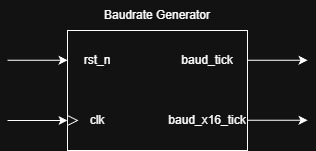
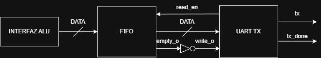
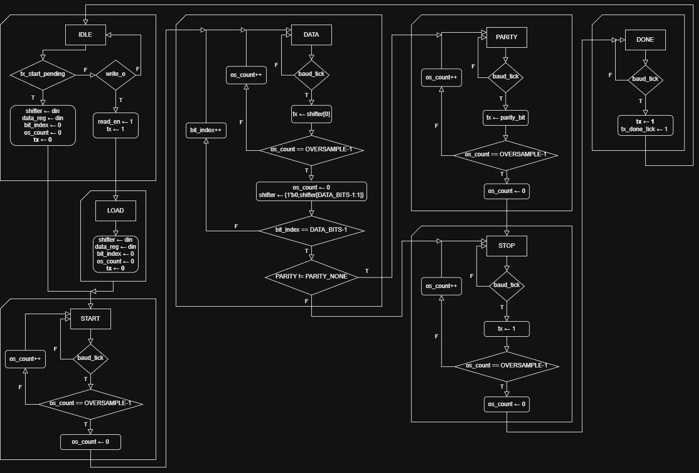
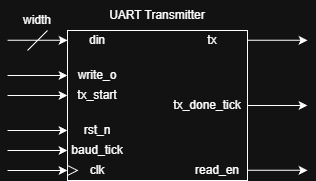
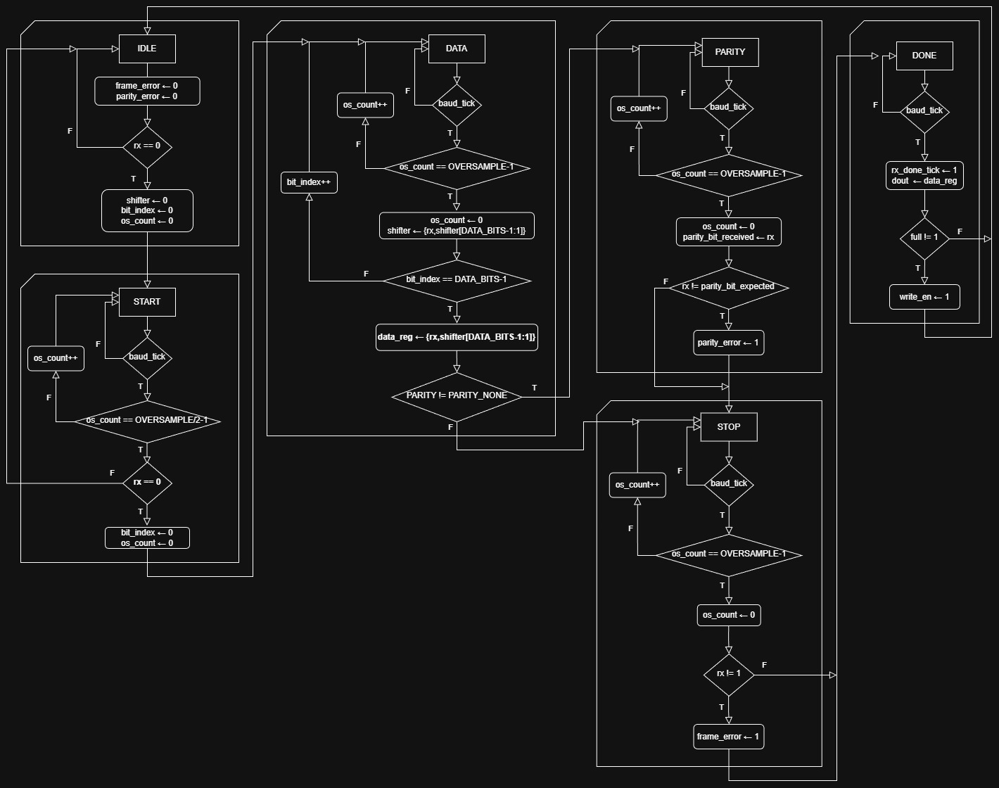
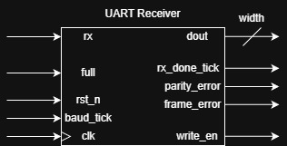

<p align="center">
  <a>
    
  </a>

***TRABAJO PRACTICO 2***

**Titulo:** UART Parametrizable para Control de ALU

**Asignatura:** Arquitectura de Computadoras

**Integrantes:**
   - Ignacio Ledesma
   - Ivan Zuñiga

---------------

## Enunciado

Desarrollar una UART (Universal Asynchronous Receiver-Transmitter) parametrizable en SystemVerilog para controlar la ALU desarrollada en el trabajo práctico anterior. La UART debe implementar comunicación serie full-duplex con parámetros configurables, incluyendo generador de baudrate, módulo transmisor y receptor.

### Requerimientos

1. **Generador de Baudrate:**
    - Implementar un divisor de frecuencia que genere señales de temporización para UART
    - Utilizar la frecuencia de reloj de 12 MHz de la Cmod A7-35T

2. **Módulo Transmisor UART (TX):**
    - Implementar máquina de estados para transmisión serie
    - Soportar formato configurable: 8 bits de datos (parametrizable)
    - (opcional) Incluir bit de paridad (parametrizable: par, impar, ninguna)
    - Configurar 1 stop bit

3. **Módulo Receptor UART (RX):**
    - Implementar máquina de estados para recepción serie
    - Detectar automáticamente el bit de start
    - Muestrear datos en el centro del bit usando oversampling
    - Verificar paridad y detectar errores de trama

4. **Integración con ALU:**
    - Interfaz de comandos para controlar la ALU del TP anterior
    - Protocolo de comunicación para envío de operandos y opcodes
    - Lectura de resultados y flags de la ALU vía UART

---

## Marco Teórico

### Comunicación UART

La comunicación UART (Universal Asynchronous Receiver-Transmitter) es un protocolo de comunicación serie asíncrona ampliamente utilizado en sistemas embebidos. A diferencia de los protocolos síncronos, UART no requiere una línea de reloj compartida, sino que depende de que ambos extremos de la comunicación operen a la misma velocidad de transmisión (baudrate).

---

## Especificaciones del Sistema

- **FPGA:** Xilinx Artix-7 (XC7A35T-1CPG236C) en placa Cmod A7-35T
- **Frecuencia de reloj:** 12 MHz (oscilador integrado)
- **Herramientas:** Vivado, SystemVerilog
- **Protocolo:** UART parametrizable (8 bits de datos, paridad, 1 stop bit)

---

## 1. Baudrate Generator

### 1.1. Baudrate y Temporización

El baudrate define la velocidad de transmisión en bits por segundo (bps). Para una comunicación exitosa, ambos dispositivos deben estar sincronizados temporalmente.

#### **Justificación del Baudrate de 9600 bps**

La selección de 9600 bps como velocidad de transmisión se basa en múltiples consideraciones técnicas y prácticas:

**1. Compatibilidad Universal**
- 9600 bps es uno de los baudrates estándar más ampliamente soportados
- Garantiza compatibilidad con la mayoría de dispositivos y software de terminal
- Es el baudrate por defecto en muchos microcontroladores y sistemas embebidos

**2. Precisión con Reloj de 12 MHz**
```
Factor de división = 12,000,000 Hz ÷ 9600 bps = 1250
Error de cuantización = 0% (división exacta)
```
Esta división exacta elimina completamente el error de cuantización, proporcionando una precisión perfecta en la temporización.

**3. Comparación con Otros Baudrates Comunes**

| Baudrate | Factor División | Error | Observaciones |
|----------|----------------|-------|---------------|
| 4800 bps | 2500 | 0% | Muy lento para aplicaciones interactivas |
| 9600 bps | 1250 | 0% | **ÓPTIMO: División exacta, velocidad adecuada** |
| 19200 bps | 625 | 0% | Rápido, pero menos tolerante a ruido |
| 38400 bps | 312.5 | ~0.16% | Requiere aproximación, introduce error |
| 115200 bps | ~104.17 | ~0.16% | Muy rápido, sensible a condiciones de línea |

**4. Consideraciones de Potencia**
- Baudrates menores resultan en menor actividad de conmutación
- Reduce el consumo de potencia en sistemas alimentados por batería
- Disminuye la generación de EMI (interferencia electromagnética)

### 1.2. Oversampling en Sistemas UART

El oversampling es una técnica que consiste en muestrear la señal de entrada múltiples veces durante cada período de bit. Esto proporciona varios beneficios:

- **Tolerancia a variaciones de frecuencia**: Compensa pequeñas diferencias entre los relojes del transmisor y receptor
- **Inmunidad al ruido**
- **Detección de partes de la trama**: Facilita la identificación de bits de start, data y stop
- **Sincronización robusta**: Permite encontrar el centro óptimo de cada bit para el muestreo

#### **Justificación del Factor de Oversampling 16x**

La elección del factor de oversampling de 16x se fundamenta en principios teóricos de procesamiento de señales y estándares de la industria:

**1. Fundamento Teórico - Teorema de Nyquist**

Frecuencia de muestreo mínima = 2 × frecuencia máxima de la señal   
Para baudrate de 9600 bps: fmin = 2 × 9600 = 19.2 kHz   
Con oversampling 16x: fsampling = 16 × 9600 = 153.6 kHz   
Margen de seguridad = 153.6 / 19.2 = 8x sobre el mínimo teórico

**2. Estándar de la Industria:** 16x es el factor de oversampling más común en UARTs comerciales

**3. Detección precisa del centro de bit**: 8 muestras antes y después del centro

### 1.3. Diagrama RTL del Baudrate Generator

<p align="center">
  <a>
    
  </a>

En este diseño, tanto el transmisor (TX) como el receptor (RX) utilizan la señal `baud_x16_tick`, un pulso de oversampling a 16× la frecuencia del baudrate. Si bien el TX podría haberse implementado con `baud_tick` (1×), ya que siempre debe esperar 16 ciclos por bit por el oversampling, se decidió emplear `baud_x16_tick` para mantener coherencia con el RX y seguir el enfoque de la bibliografía.

En contraste, el RX sí requiere estrictamente oversampling ×16: su FSM muestrea el bit de start en el tick 8 y los bits de datos, paridad y stop cada 16 ticks completos, lo que permite sincronización precisa y tolerancia a variaciones de baudrate.

En síntesis, aunque ambos módulos usan `baud_x16_tick`, en el TX se hace por uniformidad, mientras que en el RX es una necesidad funcional. La existencia simultánea de baud_tick y baud_x16_tick preserva flexibilidad en el diseño.

---

## Módulo Transmisor (TX)

### 2.1 Importancia del Transmisor UART y Relación con Baudrate Generator

El módulo transmisor UART (TX) constituye el componente crítico responsable de la serialización y transmisión de datos paralelos a través de un canal serie asíncrono. Su función principal consiste en convertir palabras de datos de ancho parametrizable (típicamente 8 bits) junto con flags de estado (zero y carry de la ALU) en una secuencia serial temporizada que cumple con el estándar UART.

#### **Frame UART: Estructura y Componentes**

Un frame UART es la unidad fundamental de transmisión en el protocolo UART. La estructura implementada en este diseño transmite **dos frames consecutivos** para cada resultado de la ALU:

**Frame 1 (Datos):**
```
[START] [D0 D1 D2 D3 D4 D5 D6 D7] [PARITY] [STOP]
   1         8 bits (LSB first)     0/1       1
```

**Frame 2 (Flags):**
```
[START] [ZERO] [CARRY] [x x x x x x] [PARITY] [STOP]
   1      1       1      6 bits relleno  0/1       1
```

**Componentes de cada frame:**

- **START bit (1 bit)**: Señaliza el inicio de la transmisión mediante una transición de 1 (idle) a 0. Permite al receptor detectar el comienzo del frame y sincronizarse.

- **DATA bits (8 bits)**: En el primer frame, contienen el resultado de la ALU. En el segundo frame, ZERO y CARRY ocupan los 2 LSBs, con 6 bits de relleno (típicamente 0) para completar el byte.

- **PARITY bit (0 o 1 bit)**: Bit opcional de verificación de integridad, calculado **independientemente** sobre los 8 bits de datos de cada frame.

- **STOP bit (1 bit)**: Señaliza el fin de la transmisión mediante el valor 1, retornando la línea al estado idle.

**Longitud total por operación ALU:**
- Sin paridad: 2 × (1 + 8 + 1) = 2 × 10 = **20 bits**
- Con paridad: 2 × (1 + 8 + 1 + 1) = 2 × 11 = **22 bits**

**Ventajas de la arquitectura de dos frames:**
- Simplifica el diseño de la FSM (reutiliza la misma lógica para ambos frames)
- Facilita la integración con FIFO estándar (cada entrada es un byte completo)
- Mantiene compatibilidad con herramientas UART estándar para el frame de datos

#### **Dependencia del Baudrate Generator**

El transmisor UART opera en estrecha sincronización con el baudrate generator mediante la señal `baud_tick`. Esta relación determina fundamentalmente el comportamiento temporal del sistema:

**1. Temporización de Bit mediante Oversampling**

Duración de bit = OVERSAMPLE × Período del baud_tick → Para 16x oversampling: cada bit dura 16 ticks del generador

**2. Avance de la Máquina de Estados Finitos (FSM)**

La FSM del transmisor únicamente actualiza su estado (salvo IDLE) cuando:
- Se completa un período de bit (contador alcanza OVERSAMPLE-1)
- La señal `baud_tick` está activa

Este mecanismo garantiza:
- **Precisión temporal perfecta**: Los bits se transmiten exactamente a la velocidad configurada
- **Sincronización robusta**: El receptor puede muestrear en el centro de cada bit
- **Independencia del reloj del sistema**: La frecuencia del sistema puede variar sin afectar el baudrate

> Esta arquitectura separa claramente las responsabilidades: el baudrate generator proporciona la base temporal precisa, mientras que el TX implementa la lógica de serialización y protocolo.

### 2.2 Justificación del Latch Interno para tx_start

#### **Problema: Uso Directo de tx_start desde Lógica Externa**

En sistemas digitales síncronos, el uso directo de señales de control desde módulos externos presenta múltiples desafíos que pueden comprometer la funcionalidad del transmisor UART:

**1. Pulsos Transitorios Muy Cortos**

Si tx_start dura solo 1 ciclo de reloj:
- Puede ocurrir entre dos baud_ticks consecutivos
- La FSM del TX nunca "ve" el pulso
- Transmisión no se inicia, dato se pierde

**2. Desincronización con baud_tick**
- La FSM del TX solo avanza cuando `baud_tick = 1` (para lograr desacople del clk del sistema y porque mejora la alineación temporal con los bits)
- Si tx_start llega cuando `baud_tick = 0`, se ignora

#### **Solución: Latch Interno Sincronizado**

El diseño implementa un registro interno `tx_start_pending` que captura y mantiene la solicitud de transmisión hasta que el sistema esté listo:

**Ventajas del Mecanismo de Latch:**

**1. Captura Garantizada de Pulsos Cortos**
```
clk         _|‾|_|‾|_|‾|_|‾|_|‾|_|‾|_
tx_start    ___|‾|_____________________
pending     _____|‾‾‾‾‾‾‾‾‾‾‾‾|_______  ← Extendido hasta baud_tick
baud_tick   _______________|‾|_________
```
El pulso de 1 ciclo se extiende automáticamente hasta el próximo baud_tick.

**2. Sincronización Automática**
- El latch actúa como buffer entre dominio de control y dominio de baudrate
- Elimina requisitos de timing estrictos para lógica externa
- Simplifica integración con ALU y otros módulos

**3. Inmunidad a Glitches**
- Solo se captura tx_start cuando `state == S_IDLE`
- Durante transmisión activa, pulsos por ruido o interferencia son ignorados
- Comportamiento determinista y predecible

### 2.3 Interfaz con la FIFO — write_o y read_en

En sistemas que requieren buffering de múltiples transmisiones (como cuando la ALU genera resultados más rápido que la capacidad del UART), se introduce una FIFO entre el productor de datos (ALU) y el transmisor UART. Esta arquitectura desacopla temporalmente ambos módulos y maximiza el throughput del sistema.

<p align="center">
  <a>
    
  </a>

#### **Señales de la Interfaz FIFO**

**write_o (input del TX, output de FIFO)**
- **Tipo**: Señal de nivel (level signal)
- **Función**: Indica que la FIFO tiene al menos un elemento disponible para transmitir
- **Comportamiento**:
  - `write_o = 1`: Dato válido presente en las salidas de la FIFO
  - `write_o = 0`: FIFO vacía, no hay datos disponibles

**read_en (output del TX, input de FIFO)**
- **Tipo**: Pulso de 1 ciclo de reloj
- **Función**: Señal de consumo que indica que el TX ha tomado el dato actual
- **Comportamiento**:
  - Genera pulso de 1 ciclo cuando TX captura dato de FIFO
  - Causa que FIFO avance al siguiente elemento (pop)
  - Solo se activa en transición `S_IDLE → S_START`
  - **Para cada operación ALU, se generan dos pulsos**: uno para el frame de datos y otro para el frame de flags

#### **Secuencia de Handshake FIFO-TX**

```
write_o  read_en   state     Acción
───────────────────────────────────────────────────────────────
0        0         S_IDLE    TX esperando
1        0         S_IDLE    FIFO ofrece dato (byte de datos)
1        1         S_START   TX acepta frame 1, genera read_en
1        0         S_DATA    Transmitiendo frame 1...
...
1        0         S_DONE    Frame 1 completo
1        0         S_IDLE    TX regresa a IDLE brevemente
1        1         S_START   TX acepta frame 2 (flags), genera read_en
1        0         S_DATA    Transmitiendo frame 2...
...
1        0         S_DONE    Frame 2 completo (operación ALU finalizada)
1        0         S_IDLE    Listo para próximo par de frames
```

**Nota importante:** Por cada operación de la ALU, la FIFO debe contener **dos bytes**:
1. Byte de datos (resultado de la ALU)
2. Byte de flags (ZERO en bit 0, CARRY en bit 1, resto en 0)

**Características clave:**
- **No bloqueante**: TX continúa transmitiendo mientras FIFO tenga datos
- **Backpressure implícito**: Si FIFO está vacía (write_o=0), TX espera en IDLE
- **Zero bubble**: Transiciones consecutivas sin ciclos muertos si FIFO siempre tiene datos

### 2.4 Comparación: Latch vs. Modo FIFO

| **Aspecto / Característica** | **Modo Pulso / Latch (tx_start)**                          | **Modo FIFO (write_o / read_en)**                       |
| ---------------------------- | ---------------------------------------------------------- | ------------------------------------------------------- |
| **Iniciación**               | Pulso de 1 ciclo, capturado por latch interno              | write_o en nivel; TX toma dato cuando está listo        |
| **Latencia inicial**         | Hasta baud_tick, depende del oversampling     | Inmediata: TX toma el siguiente dato disponible         |
| **Robustez a glitches**      | Alta (el latch filtra pulsos breves)                       | Muy alta (handshake explícito write_o/read_en)          |
| **Consumo del dato**         | Automático al detectar el pulso                            | Confirmado con read_en por parte del TX                 |
| **Throughput sostenido**     | Limitado: 2 frames por solicitud externa (datos + flags)   | Máximo: permite streaming continuo sin gaps             |
| **Escalabilidad**            | Baja (requiere un pulso por cada operación → 2 frames)     | Alta (FIFO absorbe bursts; 2 bytes por operación ALU)   |
| **Complejidad del sistema**  | Baja (1 FF + lógica mínima)                                | Media (FIFO + protocolo handshake)                      |
| **Uso de recursos FPGA**     | Mínimo                                          | Moderado                     |
| **Pérdida de datos**         | Posible si TX está ocupado y el pulso llega en mal momento | No hay pérdidas: FIFO bufferiza y TX confirma recepción |
| **Integración con ALU**      | Directa (ej: tx_start = alu_done)                          | Indirecta: la ALU escribe a FIFO, que alimenta al TX    |
| **Aplicaciones típicas**     | Transmisión ocasional o eventos aislados                   | Streaming continuo, alta tasa, pipelines                |

#### **Ventajas de la Integración con Latch**

Permite que módulos externos (como la ALU) generen pulsos de control simples sin preocuparse por:
- Timing exacto respecto a baud_tick
- Duración del pulso
- Sincronización entre dominios de reloj

Este patrón simple y robusto es posible gracias al latch interno, que absorbe la complejidad de sincronización y garantiza que ninguna solicitud de transmisión se pierda.

#### **Ventajas de la Integración con FIFO**

**1. Desacoplamiento Temporal:** el Throughput de la ALU suele ser mucho mayor que el de la UART, lo que provoca un desbalance, haciendo necesaria una FIFO para absorber ráfagas de ALU sin pérdida de datos (sumado al hecho de que cada operación de la ALU implica 2 frames enviados por la UART)

**2. Maximización de Utilización del Canal**
- TX transmite back-to-back mientras FIFO tenga datos
- Overhead entre frames reducido a 0 ciclos

**3. Simplificación de Lógica Externa**
- ALU no necesita conocer estado del UART, solo debe escribir a FIFO cuando tiene resultado
- No requiere sincronización explícita

**4. Tolerancia a Variaciones de Tasa**
- Si ALU se detiene temporalmente, TX continúa vaciando FIFO
- Si ALU acelera, FIFO bufferiza hasta alcanzar capacidad
- Sistema robusto ante condiciones variables

#### **Implementación en el Diseño Actual**

El módulo `uart_tx.sv` soporta **ambos modos simultáneamente**.
- Configuración en tiempo de síntesis (parámetro)
- Permite testing de ambos modos con mismo RTL
- Facilita migración de sistemas simples a sistemas con buffering

### 2.5 Flujo Detallado de la Máquina de Estados Finitos (FSM)

#### **Diagrama de Máquina de Estados Algorítmica**

La FSM del transmisor UART implementa el protocolo de serialización mediante los siguientes estados:

<p align="center">
  <a>
    
  </a>

#### **Tablas de Temporización**

**Duración Teórica de un Frame Individual por Modo de Paridad**

| Modo Paridad | Bits por Frame | Ticks de Baud | Ciclos @ 12 MHz | Tiempo @ 9600 bps |
|--------------|----------------|---------------|-----------------|-------------------|
| NONE | 10 | 10 × 16 = 160 | 10×1250 = 12500 | 1.042 ms |
| EVEN | 11 | 11 × 16 = 176 | 11×1250 = 13750 | 1.146 ms |
| ODD | 11 | 11 × 16 = 176 | 11×1250 = 13750 | 1.146 ms |

**Desglose de Tiempo por Estado (un frame, modo NONE)**

| Estado | Bits | Ticks Baud | % Frame | Tiempo @ 9600 bps |
|--------|------|------------|---------|-------------------|
| IDLE | - | Variable | - | Variable |
| START | 1 | 16 | 10% | 104.17 μs |
| DATA | 8 | 128 | 80% | 833.33 μs |
| STOP | 1 | 16 | 10% | 104.17 μs |
| DONE | - | 1 | <1% | 6.51 μs |
| **TOTAL** | **10** | **161** | **100%** | **1.048 ms** |

**Duración Total por Operación ALU (2 Frames):** Para completar una operación ALU, la FSM ejecuta esta secuencia **dos veces consecutivas** (frame de datos + frame de flags).

| Modo Paridad | Bits Totales | Tiempo Total @ 9600 bps |
|--------------|--------------|-------------------------|
| NONE | 2 × 10 = 20 | 2 × 1.048 ms = **2.096 ms** |
| EVEN | 2 × 11 = 22 | 2 × 1.152 ms = **2.304 ms** |
| ODD | 2 × 11 = 22 | 2 × 1.152 ms = **2.304 ms** |

### 2.6 Alcance de la Testbench del Módulo TX

La testbench del módulo `uart_tx` implementa una estrategia de verificación exhaustiva basada en vectores de prueba pregenerados mediante un script Python (`gen_uart_tx_vectors.py`). Este enfoque proporciona múltiples ventajas sobre generación de estímulos en tiempo de simulación:

**1. Modelo Dorado en Python**
- Construcción de frames esperados mediante algoritmo simple y verificable
- Cálculo de paridad en Python independiente de RTL (detecta errores de especificación)
- Generación de casos corner predefinidos (smoke tests)
- Casos random para cobertura estadística
- **Generación de vectores solo para frame de datos** (8 bits); el testbench construye internamente el frame de flags

**2. Separación de Generación y Verificación**
- Testbench consume vectores de datos y construye ambos frames esperados (datos + flags)
- Verifica secuencialmente los dos frames por cada operación
- Permite auditoría manual de vectores esperados

#### **Smoke Tests: Casos Críticos Predefinidos**

La testbench ejecuta **6 smoke tests** por cada modo de paridad, cubriendo casos esenciales. Cada test verifica **dos frames consecutivos**: uno para los datos y otro para los flags.

| Nombre | Dato (Frame 1) | Justificación |
|--------|----------------|---------------|
| BASIC_1F | 0x1F | Caso normal, patrón variado |
| ALL_ZERO | 0x00 | Todos los bits de data en 0 |
| MSB_SET | 0x80 | MSB activo, verifica LSB-first |
| ALL_ONES | 0xFF | Todos los bits de data en 1 |
| ALT_55 | 0x55 | Patrón alternado 01010101 |
| ALT_AA | 0xAA | Patrón alternado 10101010 |

**Total:** 6 casos × 3 modos de paridad = **18 smoke tests**

#### **Tests Random: Cobertura Estadística**

**9 vectores random** por modo de paridad, generados con distribución uniforme.

**Objetivo:**
- Explorar espacio de estados no cubierto por smoke tests
- Detectar errores en combinaciones no anticipadas
- Simular casos reales con datos arbitrarios

**Total:** 9 casos × 3 modos de paridad = **27 random tests**

#### **Verificaciones Realizadas por la Testbench**

**1. Serialización Bit a Bit (Ambos Frames)**

La testbench captura la línea TX mediante muestreo mid-bit:

- Compara `captured_frame` con `expected_frame` generado por Python
- Detecta errores de:
  - Orden de bits (LSB vs MSB first)
  - START/STOP incorrectos
  - Inclusión/omisión de paridad en cada frame (si aplica)
  - Valores transmitidos

**2. Timing Exacto:** verifica cuantos ciclos del clock fueron necesarios para transmistir cada frame, y si cae dentro de un rango de valores aceptable

**Detecta:**
- Errores en contador de oversampling
- Saltos de estados entre frames
- Retrasos no anticipados

**3. Cobertura de Modos de Paridad**

La testbench ejecuta **3 configuraciones completas** mediante parámetro `TEST_MODE`

**Garantiza:**
- Frames con/sin bit de paridad (10 vs 11 bits por frame)
- Cálculo correcto de paridad even/odd **independiente para cada frame**

**4. Modo FIFO Adicional**

Con `ENABLE_FIFO_MODE=1`, testbench ejecuta **6 tests adicionales** por modo de paridad:

### 2.7 Diagrama RTL del Módulo UART TX

<p align="center">
  <a>
    
  </a>

---

## 3. Módulo Receptor (RX)

### 3.1 Importancia del Receptor UART y Relación con Baudrate Generator

El módulo receptor UART (RX) constituye el componente crítico responsable de la deserialización y reconstrucción de datos serie asíncronos, convirtiéndolos en palabras paralelas procesables por la lógica digital interna. Su función principal consiste en detectar, sincronizar y validar frames UART entrantes, extrayendo los bits de datos y verificando su integridad mediante paridad y control de trama.

#### **Desafíos Fundamentales del Receptor UART**

A diferencia del transmisor, que opera en un entorno controlado y predecible, el receptor debe resolver múltiples problemas de sincronización y detección:

**1. Detección Asíncrona del START Bit**
- La línea RX permanece en estado IDLE (1 lógico) indefinidamente
- El inicio de transmisión se señaliza mediante una transición 1→0 asíncrona
- El receptor no tiene conocimiento previo de cuándo llegará el próximo frame
- Debe detectar el flanco de bajada sin depender de baud_tick

**2. Sincronización Temporal con Transmisor Remoto**
- El transmisor y receptor operan con relojes independientes
- Pueden existir diferencias de frecuencia de hasta ±3% (tolerancia UART estándar)
- Requiere mecanismo de refase para alinear muestreo con centro de cada bit
- La sincronización se pierde entre frames y debe restablecerse con cada START

**3. Reconstrucción de Datos LSB-First**
- Los bits llegan serializados en orden LSB→MSB
- Deben reconstruirse en un registro de desplazamiento
- Timing crítico: muestrear cada bit exactamente en su centro

**4. Validación de Integridad**
- Verificar paridad calculada sobre bits de datos
- Validar bit de STOP para detectar errores de sincronización
- Detectar frames malformados por ruido o desincronización

#### **Dependencia Crítica del Baudrate Generator**

El receptor UART depende **estrictamente** del oversampling 16× proporcionado por el baudrate generator.

**Proceso de Sincronización en Dos Fases:**

**Fase 1: Detección y Validación del START Bit**
```
Detección flanco 1→0 (asíncrona, sin baud_tick)
         ↓
Esperar 8 ticks de baud_x16_tick (OVERSAMPLE/2)
         ↓
Muestrear rx en el CENTRO del bit de START
         ↓
Validar que rx = 0 (confirma START válido)
```

> **Detección de Falsos Positivos:** Si en el tick 8 el valor es 1 (no 0), se detecta que el flanco fue causado por ruido, no por un START legítimo.

**Fase 2: Muestreo de Bits de Datos, Paridad y STOP**
```
Para cada bit subsecuente:
    Contar 16 ticks completos (OVERSAMPLE)
         ↓
    Muestrear rx en el último tick (que debido a la fase 1, coincide con el centro del bit)
         ↓
    Almacenar valor en shifter o registros de control
```

### 3.2 Mecanismo de Refase y Sincronización: La Clave del START Bit

El proceso de refase implementado en el estado S_START constituye el mecanismo fundamental que permite al receptor sincronizarse temporalmente con el transmisor a pesar de operar con relojes independientes.

#### **Problema: Desincronización entre Transmisor y Receptor**

En sistemas asíncronos, el receptor no tiene forma de predecir el instante exacto en que comenzará la transmisión:

El receptor detecta el flanco 1→0 en un instante arbitrario dentro del bit de START. Si comenzara a contar inmediatamente 16 ticks, muestrearía en un punto impredecible del bit, posiblemente cerca de una transición donde el valor es inestable.

#### **Solución: Refase Mediante Muestreo Mid-Bit**

El algoritmo de refase implementado resuelve este problema. El muestreo inicial en el tick 8 del bit de START no es arbitrario, sino que responde a principios fundamentales de procesamiento de señales:

1. **Refase Temporal:** Al hacer `next_os_count = '0` después del muestreo mid-bit en tick 8 la primera vez, el receptor establece un nuevo punto de referencia temporal. Los próximos bits (DATA, PARITY, STOP) se muestrearán cada 16 ticks exactos a partir de este refase, garantizando que todos los muestreos ocurran en el centro de sus respectivos bits.

2. **Máxima Tolerancia a Jitter:** El centro del bit es el punto de máxima estabilidad, equidistante de las transiciones de bit anterior y posterior.

3. **Tolerancia a Variaciones de Frecuencia:** Incluso con ±3% de error entre relojes, el muestreo mid-bit garantiza captura correcta durante todo el frame (10-11 bits).

### 3.3 Reconstrucción LSB-First en el Shifter

Los datos UART se transmiten con el bit menos significativo primero (LSB-first). El receptor debe reconstruir el byte original mediante un registro de desplazamiento.

**Copia a data_reg para Cálculo de Paridad:**

Al completar la recepción de todos los bits de datos, se copia el shifter completo a `data_reg`. Este registro se usa posteriormente para:
1. Calcular la paridad esperada (en estado S_PARITY)
2. Presentar el dato final en `dout` (en estado S_DONE)

Esta arquitectura separa las responsabilidades:
- `shifter`: registro de desplazamiento temporal durante recepción
- `data_reg`: almacenamiento estable del byte completo para procesamiento
- `dout`: salida registrada presentada al sistema superior

### 3.4 Verificación de Paridad y Detección de Errores

#### **Cálculo del Bit de Paridad Esperado**

El módulo receptor implementa cálculo combinacional de paridad idéntico al transmisor, pero con propósito de verificación en lugar de generación:

#### **Utilidades de la Paridad en Sistemas UART**

La paridad simple puede detectar:
- **Errores de 1 bit:** Cualquier cambio de un solo bit altera la paridad
**Errores impares:** 3, 5, 7... bits alterados cambian la paridad

**Limitaciones de la Paridad:**
- No puede **corregir** errores, solo detectarlos
- No detecta errores en múltiplos pares de bits. 2, 4, 6... bits alterados pueden no detectarse (paridad permanece igual)
- Overhead temporal: +1 bit por frame (~9-10% más tiempo de transmisión)

**¿Cuándo Usar Paridad?**

| Escenario | Recomendación |
|-----------|---------------|
| Líneas con ruido eléctrico | **Sí** - Detecta errores de transmisión |
| Comunicación crítica (safety) | **No** - Usar CRC o códigos más robustos |
| Sistemas de bajo consumo | **Depende** - Overhead de 1 bit (9-10% más tiempo) |
| Debugging/Desarrollo | **Sí** - Ayuda a identificar problemas de hardware |
| Baudrates altos (>115200) | **Sí** - Mayor susceptibilidad a errores de timing |

#### **Detección de Errores de Frame**

El error de frame se detecta cuando el bit de STOP no tiene el valor esperado (1 lógico):

**Causas Típicas de Frame Error:**

1. **Desincronización de Baudrate:**
   - Diferencia >3% entre relojes de TX y RX
   - Acumulación de error de timing a lo largo del frame
   - Muestreo del STOP en transición en lugar de centro

2. **Ruido en la Línea:**
   - Picos de voltaje inducidos por EMI
   - Glitches que corrompen el bit de STOP
   - Atenuación de señal en cables largos

3. **START Prematuro:**
   - Transmisor inicia nuevo frame antes de completar STOP
   - Viola temporización del protocolo UART
   - Indica problema en FSM del transmisor

4. **Línea RX Atascada en 0:**
   - Cortocircuito a GND
   - Falla de hardware en driver del transmisor
   - Cable desconectado (pull-down activo)

#### **Importancia de los Flags de Error en Sistemas Reales**

**Escenarios de Uso de parity_error y frame_error:**

1. **Protocolos de Capa Superior con Retransmisión:** Aplicación detecta error → solicita retransmisión del frame

2. **Diagnóstico de Problemas de Hardware:**
   
   - frame_error frecuente → desincronización de baudrate
   - parity_error esporádico → ruido eléctrico en la línea
   - ambos simultáneos → cable defectuoso o desconectado

3. **Sistemas Safety-Critical:**

   - Cualquier error → descarta frame y activa alarma
   - Ejemplo: Comunicación en sistemas médicos o automotrices

4. **Monitoreo de Calidad de Enlace:**

   - Contador de errores / frames totales = BER (Bit Error Rate)
   - BER > umbral → cambiar a baudrate más bajo o revisar hardware

### 3.5 Tolerancia a Variaciones de Frecuencia: Análisis Cuantitativo

La especificación UART estándar permite hasta **±3% de diferencia** entre los relojes del transmisor y receptor. El oversampling 16× proporciona margen suficiente para tolerar esta variación:

**Cálculo de Error Acumulado:**

Supongamos receptor 3% más lento que transmisor (peor caso):
```
Por cada bit transmitido:
    TX: 16 ticks nominales
    RX: 16.48 ticks reales (16 × 1.03)
    Error por bit: 0.48 ticks

Frame de 10 bits (NONE):
    Error acumulado: 10 × 0.48 = 4.8 ticks

Frame de 11 bits (EVEN/ODD):
    Error acumulado: 11 × 0.48 = 5.28 ticks
```

**Margen de Seguridad:**

El muestreo mid-bit proporciona ventana de ±8 ticks (centro del bit ± OVERSAMPLE/2):
```
Error máximo tolerable: ±8 ticks
Error real (11 bits, ±3%): ±5.28 ticks
Factor de seguridad: 8 / 5.28 ≈ 1.5× (margen del 50%)
```

Esto explica por qué UART tolera ±3% de error: el oversampling 16× con muestreo mid-bit proporciona 1.5× más margen del necesario, garantizando operación robusta incluso en condiciones límite.

**Comparación con Oversampling Menor:**

| Factor | Ventana Muestreo | Error Máx (11 bits, 3%) | Margen | Viabilidad |
|--------|------------------|-------------------------|--------|------------|
| 8× | ±4 ticks | ±5.28 ticks | **Insuficiente** | ✗ No tolera 3% |
| 16× | ±8 ticks | ±5.28 ticks | 1.5× | ✓ **ÓPTIMO** |
| 32× | ±16 ticks | ±5.28 ticks | 3× | ✓ Excesivo (overhead) |

El oversampling 16× representa el **punto óptimo** entre robustez y eficiencia de recursos.

### 3.6 Flujo Detallado de la Máquina de Estados Finitos (FSM)

La FSM del receptor UART implementa un protocolo de recepción secuencial que maneja la detección, sincronización, deserialización y validación de frames UART entrantes.

#### **Diagrama de Máquina de Estados Algorítmica**

<p align="center">
  <a>
    
  </a>

### 3.7 Verificación Exhaustiva: Testbench del Receptor UART

#### **Arquitectura de Verificación Basada en Vectores Python**

La verificación del módulo receptor UART se implementó mediante una estrategia de golden model, donde un script Python (`gen_uart_rx_vectors.py`) genera vectores de prueba que sirven como referencia para validar el comportamiento del DUT (Device Under Test). Se sigue la misma filosofía que con el módulo transmisor UART.

#### **Categorías de Vectores de Prueba**

El generador Python produce **50 vectores totales** distribuidos en tres modos de paridad (NONE, EVEN, ODD) y tres categorías de casos:

**1. Smoke Tests (6 Vectores por Modo)**

Casos básicos predefinidos para validación rápida:
- `BASIC_1F` (0x1F): Patrón con bits alternados en nibble bajo
- `ALL_ZERO` (0x00): Todos los bits en 0
- `MSB_SET` (0x80): Solo MSB activo
- `ALL_ONES` (0xFF): Todos los bits en 1
- `ALT_55` (0x55): Patrón alternado 01010101
- `ALT_AA` (0xAA): Patrón alternado 10101010

Estos casos validan:
- Reconstrucción correcta de patrones conocidos
- Muestreo LSB-first funcional
- Cálculo correcto de paridad para casos extremos

**2. Random Tests (9 Vectores por Modo)**

Casos generados pseudoaleatoriamente con **semillas fijas** para reproducibilidad:

Ventajas:
- Cobertura del espacio de datos (0-255)
- Reproducibilidad entre ejecuciones (mismos vectores siempre)
- Validación de casos no anticipados en smoke tests

**3. Error Tests (1-2 Vectores por Modo)**

Casos con errores intencionales para validar detección:

**a) Frame Error (Todos los Modos):**
```python
data_ferr = 0x99 # STOP bit forzado a 0 en lugar de 1
```
Valida que `frame_error` flag se active correctamente.

**b) Parity Error (Solo EVEN/ODD):**
```python
data_perr = 0x42 # Bit de paridad invertido intencionalmente
```
Valida que `parity_error` flag se active correctamente.

**Distribución Total de Vectores:**
- **NONE:** 6 smoke + 9 random + 1 frame_err = **16 vectores**
- **EVEN:** 6 smoke + 9 random + 1 parity_err + 1 frame_err = **17 vectores**
- **ODD:** 6 smoke + 9 random + 1 parity_err + 1 frame_err = **17 vectores**
- **TOTAL:** 16 + 17 + 17 = **50 vectores**

#### **Mecánica del Testbench: Inyección Serial y Captura de Respuesta**

El testbench implementa dos componentes críticos:

**1. Tarea inject_frame: Inyección Bit-a-Bit con Timing Preciso:** Esta tarea simula un transmisor UART perfecto, replicando el timing exacto que el receptor espera.

**2. Monitor de Captura Asíncrono con Always Block:** el testbench emplea un always block que captura el pulso en paralelo con la inyección

#### **Validación Multi-Aspecto por Vector**

Para cada vector de prueba, el testbench valida:

**1. Reconstrucción Correcta del Byte**

**2. Detección Correcta de Error de Paridad**

**3. Detección Correcta de Error de Frame:**

**4. Generación de Pulso rx_done_tick:**

### 3.8 Comparación Transmisor (TX) vs Receptor (RX)

Ambos módulos comparten principios arquitectónicos fundamentales pero difieren en sus desafíos y mecanismos de operación:

#### **Diferencias Fundamentales**

| Característica | TX (Generador de Bits) | RX (Reconstructor de Bits) |
|----------------|------------------------|----------------------------|
| **Dirección de flujo** | Paralelo → Serie | Serie → Paralelo |
| **Sincronización** | Controlada | Asíncrona (detectar START) |
| **Detección de errores** | No genera (asume datos válidos) | **Debe detectar** (parity_error, frame_error) |
| **Estado IDLE** | Espera tx_start con latch o señal en alto de FIFO | **Monitoreo continuo** de línea RX |
| **Criticidad de mid-bit** | No crítico (genera bits completos) | **Crítico** (único punto de muestreo estable) |

#### **Complementariedad en el Sistema UART Full-Duplex**

- **TX:** Serializa comandos y resultados de la ALU para transmisión remota
- **RX:** Deserializa comandos recibidos para control de la ALU local

En un sistema bidireccional completo, cada dispositivo tiene un TX y un RX operando simultáneamente, permitiendo comunicación full-duplex asíncrona.

### 3.9 Diagrama RTL del Módulo UART RX

<p align="center">
  <a>
    
  </a>

---
