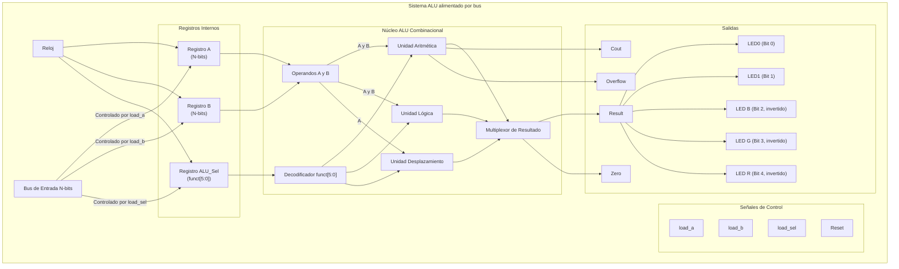

# Conexiones de Módulos de la ALU

Este documento contiene un gráfico  que ilustra las conexiones y el flujo de datos para la ALU alimentado por un bus. Este diseño es necesario cuando solo hay un bus de entrada disponible para operandos y señales de control.

### Cómo Funciona el Diseño:

1.  **Bus de Entrada Único**: Hay un solo bus de entrada, `data_in`, para todo.
2.  **Señales de Control**: Se necesitan entradas de control para manejar el bus mencionado anteriormente.
    *   `load_a`: Cuando esta señal está alta, el valor en `data_in` se carga en el `Registro A` en el siguiente flanco de reloj.
    *   `load_b`: Cuando está alta, `data_in` se carga en el `Registro B`.
    *   `load_sel`: Cuando está alta, `data_in` se carga en el `Registro ALU_Sel`.
3.  **Registros Internos**: `reg_a`, `reg_b` y `reg_sel` son esenciales. Mantienen el contexto para la operación.
4.  **Código de Operación (`reg_sel`)**: El registro de selección almacena el campo `funct` de 6 bits. Los bits `[5:2]` definen la familia (1000 = aritmética, 1001 = lógica, 0000 = desplazamientos) y los bits bajos seleccionan la operación específica.
5.  **Secuencia de Operación**: Para realizar una operación (por ejemplo, resta):
    *   **Ciclo 1**: Coloca el valor del operando A en `data_in`, establece `load_a` alto. El flanco de reloj captura el valor en `reg_a`.
    *   **Ciclo 2**: Coloca el valor del operando B en `data_in`, establece `load_b` alto. El flanco de reloj captura el valor en `reg_b`.
    *   **Ciclo 3**: Coloca el código `6'b100010` (SUB) en `data_in`, establece `load_sel` alto. El flanco de reloj captura el valor en `reg_sel`.
6.  **Cálculo Continuo**: Luego de que los registros se cargan, el núcleo  de la ALU, completamente combinacional extrae la familia desde `opcode[5:2]` y luego emplea los bits bajos para escoger la operación dentro de esa familia. Con ello se fijan los selectores internos (`arith_sel`, `logic_sel`, `shift_sel`) y se enruta el resultado correcto a la salida.
