# Conexiones de Módulos ALU (Arquitectura Alimentada por Bus)

Este documento contiene un gráfico Mermaid que ilustra las conexiones y el flujo de datos para un sistema ALU secuencial alimentado por bus. Este diseño es necesario cuando solo hay un bus de entrada disponible para operandos y señales de control.

```mermaid
graph TD
    subgraph "Sistema ALU Alimentado por Bus (Secuencial)"
        direction LR

        clk[Reloj]
        data_in[Bus de Entrada N-bits]
        
        subgraph "Señales de Control"
            direction TB
            load_a[load_a]
            load_b[load_b]
            load_sel[load_sel]
            rst[Reset]
        end

        subgraph "Registros Internos"
            direction TB
            reg_a["Registro A<br/>(N-bits)"]
            reg_b["Registro B<br/>(N-bits)"]
            reg_sel["Registro ALU_Sel<br/>(OpCode + Cin)"]
        end
        
        subgraph "Núcleo ALU Combinacional"
            direction TB
            operands["Operandos A y B"]
            mux_op["Multiplexor opcode[2:0]"]
            arith_inst["Unidad Aritmética"]
            logic_inst["Unidad Lógica"]
            shift_inst["Unidad Desplazamiento"]
            mux_family["Multiplexor Familia<br/>(opcode[4:3])"]
        end

        subgraph "Salidas"
            Result
            Cout
            Overflow
            Zero
            LED0["LED0 (Bit 0)"]
            LED1["LED1 (Bit 1)"]
            LED_B_n["LED B (Bit 2, invertido)"]
            LED_G_n["LED G (Bit 3, invertido)"]
            LED_R_n["LED R (Bit 4, invertido)"]
        end

        clk --> reg_a
        clk --> reg_b
        clk --> reg_sel

        data_in -- "Controlado por load_a" --> reg_a
        data_in -- "Controlado por load_b" --> reg_b
        data_in -- "Controlado por load_sel" --> reg_sel

        reg_a --> operands
        reg_b --> operands

        reg_sel -- "opcode[2:0]" --> mux_op
        mux_op --> arith_inst
        mux_op --> logic_inst
        mux_op --> shift_inst

        reg_sel -- "opcode[4:3]" --> mux_family

        operands -- "A y B" --> arith_inst
        operands -- "A y B" --> logic_inst
        operands -- "A" --> shift_inst

        arith_inst --> mux_family
        logic_inst --> mux_family
        shift_inst --> mux_family

        mux_family --> Result
        arith_inst --> Cout
        arith_inst --> Overflow
        mux_family --> Zero
        Result --> LED0
        Result --> LED1
        Result --> LED_B_n
        Result --> LED_G_n
        Result --> LED_R_n
    end

    style arith_inst fill:#000,stroke:#fff,stroke-width:2px
    style logic_inst fill:#000,stroke:#fff,stroke-width:2px
    style shift_inst fill:#000,stroke:#fff,stroke-width:2px
    style mux_family fill:#000,stroke:#fff,stroke-width:2px
    style mux_op fill:#000,stroke:#fff,stroke-width:2px
```

### Cómo Funciona el Diseño:

1.  **Bus de Entrada Único**: Hay un solo bus de entrada, `data_in`, para todo.
2.  **Señales de Control**: Se necesitan nuevas entradas para controlar el proceso de carga:
    *   `load_a`: Cuando esta señal está alta, el valor en `data_in` se carga en el `Registro A` en el siguiente flanco de reloj.
    *   `load_b`: Cuando está alta, `data_in` se carga en el `Registro B`.
    *   `load_sel`: Cuando está alta, `data_in` se carga en el `Registro ALU_Sel`.
3.  **Registros Internos**: `reg_a`, `reg_b` y `reg_sel` son esenciales. Mantienen el contexto para la operación.
4.  **Código de Operación (`ALU_Sel`) y `Cin`**: El `Registro ALU_Sel` ahora contiene un valor más amplio (por ejemplo, 5 bits). Los bits superiores representan la operación principal (ADD, SUB, etc.), mientras que el bit menos significativo (`bit 0`) se usa como el valor `Cin` para el Núcleo ALU. Esto se carga en un solo paso vía la señal `load_sel`.
5.  **Secuencia de Operación**: Para realizar una operación (por ejemplo, resta):
    *   **Ciclo 1**: Coloca el valor del operando A en `data_in`, establece `load_a` alto. El flanco de reloj captura el valor en `reg_a`.
    *   **Ciclo 2**: Coloca el valor del operando B en `data_in`, establece `load_b` alto. El flanco de reloj captura el valor en `reg_b`.
    *   **Ciclo 3**: Coloca el código de operación combinado (por ejemplo, `5'b0001_1` para SUB) en `data_in`, establece `load_sel` alto. El flanco de reloj captura el valor en `reg_sel`.
6.  **Cálculo Continuo**: Tan pronto como los registros se cargan, el **núcleo ALU combinacional** usa instantáneamente los valores de `reg_a`, `reg_b` y los bits apropiados de `reg_sel` para calcular el resultado. El multiplexor de opcode[2:0] distribuye la operación a las unidades funcionales, y el multiplexor de familia selecciona la salida final basada en opcode[4:3].
